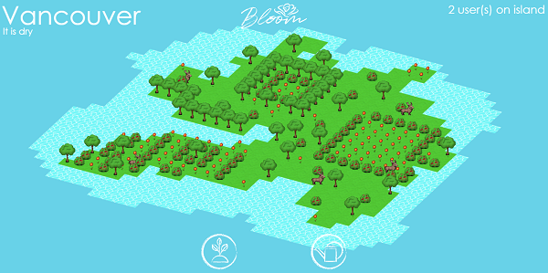

# Bloom

Sit down with a fresh cup of tea and relax in this online multiplayer gardening game. 

Click [here](https://bloomhw4.herokuapp.com/) to play.

Bloom uses real-time weather data! To choose a specific location:

- [London](https://bloomhw4.herokuapp.com/london) (Default)
- [Los Angeles](https://bloomhw4.herokuapp.com/losangeles)
- [Halifax](https://bloomhw4.herokuapp.com/halifax)
- [Vancouver](https://bloomhw4.herokuapp.com/vancouver)

Built for [Hack Western 4](https://hackwestern4.devpost.com/) in 2017.

# Setup

To run, you must have [Node](https://nodejs.org/en/) installed.

Use `npm install` in the root directory to fetch dependencies.

Use `npm start` to run the app locally.

## Awards

- Winner of Best Web Game by Big Viking Games

See the [Devpost submission](https://devpost.com/software/bloom-k50zoy) for details.

## Authors

- Jerry Yuan Chen (Programmer)
- Justin Koh (Programmer)
- Shirley Jiang (Artist)
- Victor Zhuoyue Shi (Programmer)
